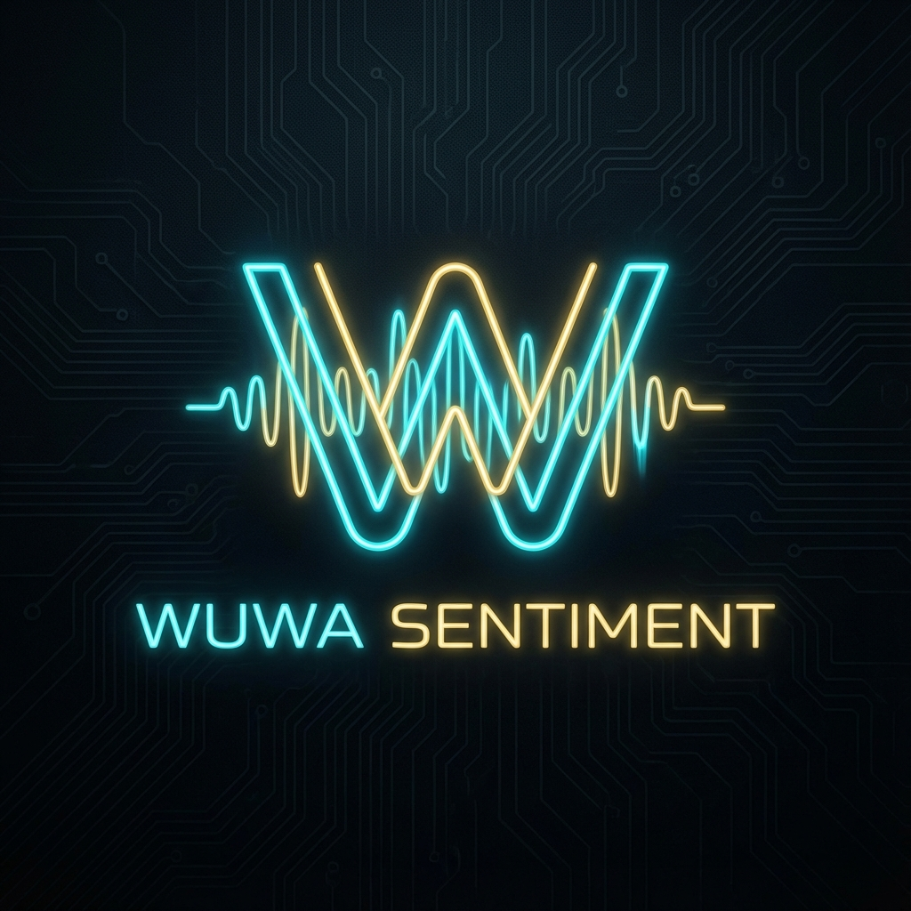

# Analisis Sentimen Wuthering Waves (Optimized Edition)



Project ini adalah aplikasi web analisis sentimen tingkat lanjut untuk ulasan game **Wuthering Waves**. Menggunakan model **Random Forest** yang telah dioptimasi dengan teknik **SMOTE** (untuk menangani ketidakseimbangan data) dan **Data Augmentation** (untuk menangani outlier), aplikasi ini mencapai akurasi **95.08%**.

Antarmuka pengguna (Frontend) telah didesain ulang sepenuhnya dengan tema **"Tacet Discord Terminal"** (Dark Sci-Fi) yang terinspirasi dari estetika dalam game.

---

## 🚀 Fitur Unggulan

### 🧠 Model & Intelijen
- **Akurasi Tinggi (95%)**: Menggunakan Random Forest dengan Hyperparameter Tuning.
- **SMOTE & Augmentasi**: Menangani ketidakseimbangan data dan kasus pojok (misal: "game nya jelek banget" terdeteksi akurat sebagai negatif).
- **Preprocessing Komprehensif**: Cleaning, Stemming (Sastrawi), Stopword Removal, dan Normalisasi kata gaul (misal: `wuwa` -> `wuthering waves`, `char` -> `karakter`).

### 🎨 Desain & UX (New!)
- **Tema Dark Sci-Fi**: Glassmorphism, Neon Cyan/Gold Accents, dan Background HD.
- **Dashboard Real-time**: Visualisasi metrik akurasi dan distribusi data menggunakan grafik interaktif.
- **Terminal Input**: Antarmuka prediksi dengan animasi scanning futuristik.

---

## 🛠️ Teknologi Stack

### Backend
- **Python 3.8+**: Core logic.
- **Flask**: REST API server.
- **Scikit-Learn**: Random Forest, TF-IDF, GridSearchCV.
- **Imbalanced-learn**: SMOTE Pipeline.
- **Sastrawi**: NLP Bahasa Indonesia.

### Frontend
- **React 19**: UI Library modern.
- **Tailwind CSS v3**: Styling framework dengan kustom konfigurasi (Animations, Typography).
- **Lucide React**: Ikon set modern.
- **Recharts**: Library grafik untuk visualisasi data.

---

## 📦 Instalasi dan Cara Menjalankan

### 1. Prasyarat
- Python (v3.8+)
- Node.js (v18+) & npm

### 2. Setup Backend (Server)
```bash
cd backend
pip install -r requirements.txt  # Jika ada, atau install manual library di bawah
# pip install flask flask-cors pandas numpy scikit-learn Sastrawi nltk imbalanced-learn joblib
python app.py
```
> Server berjalan di: `http://localhost:5000`

### 3. Setup Frontend (UI)
```bash
cd frontend/sentimen_wuwa
npm install
npm run dev
```
> Aplikasi berjalan di: `http://localhost:3000`

---

## 🤖 Alur Kerja Data

1.  **Input Pengguna**: Teks ulasan dimasukkan melalui terminal UI.
2.  **Preprocessing**:
    - Cleaning (Regex)
    - Normalisasi (`wuwa` -> `wuthering waves`)
    - Stopword Removal (`yang`, `dan`, dll dibuang)
    - Stemming (`bermain` -> `main`)
3.  **Vektorisasi**: TF-IDF mengubah teks menjadi angka.
4.  **Prediksi**: Model Random Forest (trained on 3,741 augmented data) menentukan sentimen.
5.  **Output Visual**: Hasil ditampilkan dengan indikator confidence level.

---
**Tugas Akhir - Analisis Sentimen Wuthering Waves**
